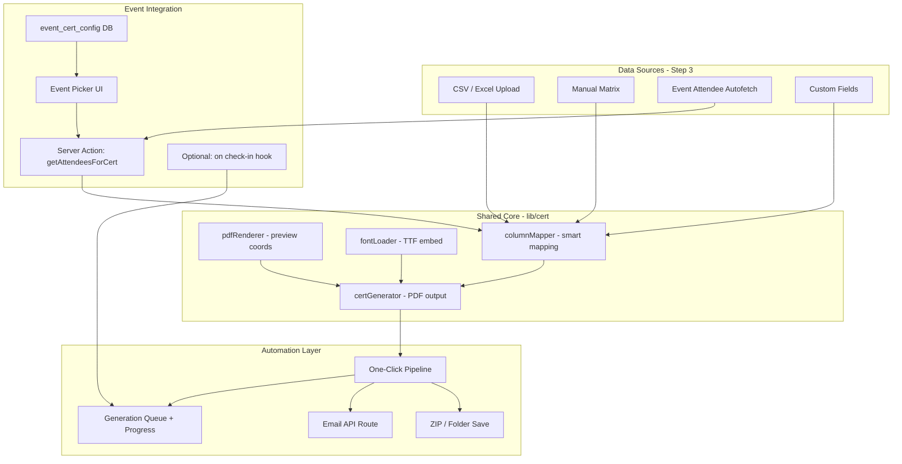

# Certificate Generator — Implementation Plan

This plan is based on the current codebase: a **client-side 6-step wizard** (`/dashboard/cert`, `/admin/cert`) with batch PDF generation, ZIP export, and manual entry — but **no event integration, no email delivery, and incomplete PDF fidelity**. The ROADMAP marks auto-certificates as done; that is **not implemented in code**.

---

## Current state (what works vs what doesn’t)

| Area | Status |
|------|--------|
| PDF template upload + field placement UI | Works |
| CSV/Excel import + batch generate + ZIP | Works |
| Manual entry / review filmstrip | Works |
| Text placement matching preview | **Broken / unreliable** |
| Fonts matching preview | **Broken / unreliable** |
| PNG export, date format, PDF compression | UI only — not wired |
| Event attendee import | **Missing** |
| One-click generate + send | **Missing** |
| Per-event auto-certificate config | **Missing** |
| Auto-generate on check-in | **Missing** |
| Persistence (templates, projects) | **Missing** — lost on refresh |

**Reusable building blocks already in the repo:**
- `getEventAttendees()` in `lib/actions/pr-actions.ts`
- Attendee CSV/Excel export in `PRAttendeeTableClient.tsx` (manual bridge today)
- `profiles.email` used in IIC reports (email exists for some users)
- Partial fixes in `pdfRenderer.ts`, `fontLoader.ts`, `certGenerator.ts` from the last session

---

## Guiding principles (to avoid breaking other systems)

1. **Additive only** — new tables, API routes, and UI tabs; don’t change event registration, scanner, or attendance flows unless behind a feature flag.
2. **Shared renderer** — one `certGenerator.ts` path for wizard, event import, and auto-send.
3. **WYSIWYG first** — fix placement/fonts before automation; otherwise auto-send sends wrong certs.
4. **Server for sensitive ops** — attendee fetch and email send via server actions/API; PDF generation can stay client-side initially.
5. **Feature flags** — `event_cert_enabled`, `auto_send_on_generate` off by default until tested.

---

## Architecture target



---

## Phase 0 — Fix core fidelity (P0, ~1 week)

**Goal:** What you place in Step 2 is exactly what appears in the generated PDF.

### 0.1 Coordinate system (single source of truth)

| Task | Details | Files |
|------|---------|-------|
| **0.1.1** | Store field coords in **PDF points** only (not canvas pixels) | `pdfRenderer.ts`, `Step1UploadTemplate.tsx`, `CertificateGeneratorWorkspace.tsx` |
| **0.1.2** | Add `coordSpace: 'pdf-points'` on `CertField` or project metadata for migration | `types.ts`, `certGenerator.ts` |
| **0.1.3** | Remove or narrow legacy `detectLegacyCoordScale()` once migration UI exists | `certGenerator.ts` |
| **0.1.4** | Fix `pdf.destroy()` before `pageCount` read | `pdfRenderer.ts` |
| **0.1.5** | Add debug overlay mode: show field box + baseline in preview | `FieldBox.tsx` (dev flag) |

**Acceptance:** Place a field at center → generated PDF text is centered on the same spot (±2pt).

### 0.2 Font fidelity

| Task | Details | Files |
|------|---------|-------|
| **0.2.1** | Pin Fontsource package versions per font (not `@latest`) | `fontLoader.ts` |
| **0.2.2** | Fix weight fallback cache key bug (requested vs actual weight) | `fontLoader.ts` |
| **0.2.3** | Validate all 30 `AVAILABLE_FONTS` slugs against Fontsource | `fontLoader.ts` + test script |
| **0.2.4** | Bundle critical fonts in `/public/fonts/` as offline fallback | `public/fonts/`, `fontLoader.ts` |
| **0.2.5** | Use same font family in preview and PDF (reduce Google vs Fontsource mismatch) | `FieldBox.tsx`, `injectFontPreview` |
| **0.2.6** | Real Helvetica fallback when embed fails (already started) | `certGenerator.ts` |

**Acceptance:** Playfair Display, Great Vibes, Inter at 400/700 render identically in preview and PDF.

### 0.3 Renderer parity (all `CertField` props)

| Task | Details | Files |
|------|---------|-------|
| **0.3.1** | Honor `textAlign`, `verticalAlign` (partially done) | `certGenerator.ts` |
| **0.3.2** | Honor `textTransform` in preview (`FieldBox`) | `FieldBox.tsx` |
| **0.3.3** | Rotation around field box center, not baseline corner | `certGenerator.ts` |
| **0.3.4** | Multi-line text + `lineHeight` | `certGenerator.ts` |
| **0.3.5** | `letterSpacing` (pdf-lib limits — document what’s supported) | `certGenerator.ts` |
| **0.3.6** | Wire `dateFormat` when field type is `date` | `certGenerator.ts`, `Step4StyleFonts.tsx` |

**Acceptance:** Side-by-side screenshot of Step 2 preview vs PDF output matches for align, rotation, transform.

### 0.4 Step 2 / Step 3 bug fixes

| Task | Details | Files |
|------|---------|-------|
| **0.4.1** | Fix `FieldBox` stale closure on resize | `FieldBox.tsx` |
| **0.4.2** | Push undo history on drag/resize mouseUp | `Step2PlaceFields.tsx` |
| **0.4.3** | Block Manual Entry Mode without template upload | `ManualEntryMode.tsx`, `CertificateGeneratorWorkspace.tsx` |
| **0.4.4** | Smart column mapping — **no** default to `headers[0]` for unmapped fields | `Step3LoadData.tsx` |
| **0.4.5** | Standard alias map: `Name` ↔ `full_name` ↔ `Recipient Name` | new `lib/cert/columnMapper.ts` |

---

## Phase 1 — Data sources: custom + autofetch (P1, ~1 week)

**Goal:** Step 3 supports file upload, manual entry, **and** event attendee import without CSV export.

### 1.1 Event attendee autofetch

| Task | Details | Files |
|------|---------|-------|
| **1.1.1** | Create `getAttendeesForCertificate(eventId, { onlyCheckedIn })` server action | new `lib/actions/cert-actions.ts` |
| **1.1.2** | Auth: faculty roles (admin, manager, teacher, hod, cc) + event creator/assignee | reuse patterns from `pr-actions.ts` |
| **1.1.3** | Return normalized rows: `{ Name, USN, Department, Semester, Year, Email, Event, EventDate, Status }` | `cert-actions.ts` |
| **1.1.4** | Add Step 3 tab: **“From Event”** with event search/picker (past + completed events) | `Step3LoadData.tsx` |
| **1.1.5** | Filters: All registered / Checked-in only / Absent | `Step3LoadData.tsx` |
| **1.1.6** | Auto-map event columns → `CertField.dataColumn` via `columnMapper` | `columnMapper.ts` |
| **1.1.7** | Deep link: `/dashboard/cert?eventId=xxx` pre-fills Step 3 | `CertificateGeneratorWorkspace.tsx` |
| **1.1.8** | “Generate Certificates” CTA on manager/PR event attendance page | `PRAttendeeTableClient.tsx`, manager attendance page |

**Acceptance:** From an event page → one click → cert wizard opens with attendee rows loaded and mapped.

### 1.2 Custom data improvements

| Task | Details | Files |
|------|---------|-------|
| **1.2.1** | Allow ad-hoc custom columns not tied to placed fields | `Step3LoadData.tsx`, `types.ts` |
| **1.2.2** | Event metadata tokens: `{Event}`, `{EventDate}`, `{Club}` in filename + fields | `zipExporter.ts`, `cert-actions.ts` |
| **1.2.3** | Preview row picker in Step 2 (sample name from row 1) | `Step2PlaceFields.tsx` |
| **1.2.4** | Validation: warn on unmapped required fields before Step 5 | `Step5Generate.tsx` |

---

## Phase 2 — One-click automation (P1, ~1 week)

**Goal:** Single action: **Generate all → Package → Deliver**.

### 2.1 Unified automation pipeline

| Task | Details | Files |
|------|---------|-------|
| **2.1.1** | Create `runCertificatePipeline(options)` orchestrator | new `lib/cert/pipeline.ts` |
| **2.1.2** | Steps: validate → generate batch → optional review skip → ZIP → optional email → log | `pipeline.ts` |
| **2.1.3** | UI: **“Generate & Download ZIP”** (exists) + **“Generate & Send All”** (new) | `Step5Generate.tsx` |
| **2.1.4** | Progress: unified status (generating / packaging / sending) | `Step5Generate.tsx` |
| **2.1.5** | Pause/resume/cancel across full pipeline | `Step5Generate.tsx` |
| **2.1.6** | Idempotency: don’t re-send if `status === 'sent'` | `types.ts` extend `CertRow` |

### 2.2 Email delivery (server-side)

| Task | Details | Files |
|------|---------|-------|
| **2.2.1** | API route `POST /api/cert/send` — accepts batch metadata + signed storage URLs or base64 chunks | new `app/api/cert/send/route.ts` |
| **2.2.2** | Use existing email infra (Resend/SMTP — match IIC report pattern) | check `app/api/reports/` |
| **2.2.3** | Email template: event name, attachment, optional portal link | new `lib/cert/emailTemplate.ts` |
| **2.2.4** | Require `Email` column or profile email; skip + log rows without email | `pipeline.ts` |
| **2.2.5** | Rate limiting + batch size (e.g. 50/min) to avoid provider limits | API route |
| **2.2.6** | Delivery log per row: `sent_at`, `error` | extend `CertRow` or `cert_delivery_log` table |

**Acceptance:** One button generates 50 certs, zips them, emails each student with their PDF.

### 2.3 Quick actions (faculty UX)

| Task | Details |
|------|---------|
| **2.3.1** | Event page: **“Certificates → Generate & Send”** (uses saved template if configured) |
| **2.3.2** | Post-generation summary modal: sent / failed / skipped counts |
| **2.3.3** | Retry failed sends only |

---

## Phase 3 — Per-event auto-certificate config (P2, ~1 week)

**Goal:** Bind a template + field layout to an event so staff don’t redo setup every time.

### 3.1 Database schema (new tables only)

```sql
-- event_certificates: per-event cert configuration
event_certificates (
  id uuid PK,
  event_id uuid UNIQUE REFERENCES events(id),
  template_storage_path text,      -- Supabase Storage
  fields_json jsonb,               -- CertField[]
  global_font text,
  global_color text,
  global_font_scale numeric,
  filename_pattern text,
  auto_generate_on_checkin boolean DEFAULT false,
  auto_send_email boolean DEFAULT false,
  send_to_checked_in_only boolean DEFAULT true,
  enabled boolean DEFAULT false,
  created_by uuid,
  created_at timestamptz,
  updated_at timestamptz
)

-- cert_generation_runs: audit trail
cert_generation_runs (
  id uuid PK,
  event_id uuid,
  triggered_by uuid,
  trigger_type text,  -- 'manual' | 'checkin' | 'batch'
  total_count int,
  success_count int,
  failed_count int,
  created_at timestamptz
)

-- cert_deliveries: per-student delivery record
cert_deliveries (
  id uuid PK,
  run_id uuid,
  registration_id uuid,
  student_id uuid,
  storage_path text,
  email_sent boolean,
  email_sent_at timestamptz,
  error text,
  created_at timestamptz
)
```

### 3.2 Template persistence

| Task | Details | Files |
|------|---------|-------|
| **3.2.1** | Supabase Storage bucket `cert-templates` (private, RLS) | migration |
| **3.2.2** | Save/load project: template PDF + fields + settings | `cert-actions.ts` |
| **3.2.3** | “Save as Event Template” in cert wizard Step 6 | `Step6Review.tsx` |
| **3.2.4** | Event edit page: **Certificates** section (enable, upload template, field editor link) | manager event page |
| **3.2.5** | Load saved template when opening cert wizard with `?eventId=` | workspace |

**Acceptance:** Configure once for Event X; next time open wizard → template + fields pre-loaded.

---

## Phase 4 — Auto-generate on attendance (P2, ~1–2 weeks)

**Goal:** Optional instant cert when a student is marked present (matches ROADMAP intent).

| Task | Details | Risk mitigation |
|------|---------|-----------------|
| **4.1** | Event flag `auto_generate_on_checkin` in `event_certificates` | Off by default |
| **4.2** | On `checked_in = true` update → enqueue cert job | DB trigger or server action in scanner — **don’t block check-in UI** |
| **4.3** | Background: generate PDF server-side OR queue for client batch | Start with **deferred batch** (every 5 min) before real-time |
| **4.4** | Store PDF in Storage; link on `cert_deliveries` | |
| **4.5** | Student portal: “Download Certificate” on attended events | `StudentAttendanceClient.tsx` — read-only, no gen logic change |
| **4.6** | Optional auto-email on generation | Uses Phase 2 email route |
| **4.7** | Faculty dashboard: pending cert queue for event | new widget |

**Acceptance:** Enable auto-cert on test event → check in student → cert appears in student attendance within N minutes.

---

## Phase 5 — Polish, testing, non-breaking rollout (ongoing)

| Task | Details |
|------|---------|
| **5.1** | Wire `exportFormat` PNG / `pngDpi` (canvas render post-PDF) | `certGenerator.ts` |
| **5.2** | Wire `pdfCompression` to `pdfDoc.save({ useObjectStreams })` | `certGenerator.ts` |
| **5.3** | Move admin logs from `localStorage` to `cert_generation_runs` | `AdminLogs.tsx` |
| **5.4** | Playwright E2E: upload → place → import attendees → generate → ZIP | `TEST/Playwright/` |
| **5.5** | Visual regression: preview vs PDF pixel diff (sample templates) | |
| **5.6** | Feature flags in env: `CERT_EVENT_IMPORT`, `CERT_AUTO_SEND`, `CERT_AUTO_CHECKIN` | |
| **5.7** | Documentation for faculty: column naming conventions | internal doc |

---

## Recommended task list (prioritized backlog)

### Sprint 1 — Make it correct (do first)
- [ ] **T1** Fix PDF point coordinates end-to-end (0.1)
- [ ] **T2** Fix font loading + validate all fonts (0.2)
- [ ] **T3** Preview/PDF parity: align, rotation, transform (0.3)
- [ ] **T4** Fix column auto-map (no wrong fallback) (0.4.4–0.4.5)
- [ ] **T5** Fix FieldBox resize + undo (0.4.1–0.4.2)
- [ ] **T6** E2E smoke test for placement accuracy

### Sprint 2 — Make it fast for events
- [ ] **T7** `getAttendeesForCertificate` server action (1.1)
- [ ] **T8** Step 3 “From Event” tab + event picker (1.1)
- [ ] **T9** Deep link `?eventId=` + attendance page CTA (1.1)
- [ ] **T10** `columnMapper` with standard aliases (1.1)
- [ ] **T11** Pre-generation validation warnings (1.2)

### Sprint 3 — One-click automation
- [ ] **T12** `pipeline.ts` orchestrator (2.1)
- [ ] **T13** “Generate & Send All” UI (2.1)
- [ ] **T14** `/api/cert/send` email route (2.2)
- [ ] **T15** Delivery status + retry failed (2.2)
- [ ] **T16** Event page quick action button (2.3)

### Sprint 4 — Persistent event templates
- [ ] **T17** DB migration `event_certificates` + Storage bucket (3.1)
- [ ] **T18** Save/load event template (3.2)
- [ ] **T19** Event settings Certificates section (3.2)
- [ ] **T20** Admin audit via `cert_generation_runs` (3.1)

### Sprint 5 — Auto on check-in (optional, flagged)
- [ ] **T21** Check-in hook / deferred job queue (4.2–4.3)
- [ ] **T22** Student download portal (4.5)
- [ ] **T23** Auto-email on check-in (4.6)

---

## What NOT to change (safety boundary)

| System | Rule |
|--------|------|
| `registrations` check-in flow | Add hooks only; never fail check-in if cert gen fails |
| Scanner / PR pages | Add optional CTA links only |
| Student registration | No changes |
| Existing CSV/Excel import | Keep working; event import is additive tab |
| `/api/reports/*` | Don’t modify; copy email patterns only |
| Auth / RLS | New tables get their own policies; don’t loosen existing ones |

---

## Suggested UX flow (target)

**Manual (today, improved):**  
Upload → Place fields → Load data (file / manual / **event**) → Style → **Generate & Download** or **Generate & Send**

**Event-powered (new):**  
Event page → **Issue Certificates** → template auto-loaded → attendees auto-loaded → **One click: Generate & Send to all checked-in**

**Fully automated (future, flagged):**  
Event config: enable auto-cert → on check-in → PDF stored → email sent → student can re-download anytime

---

## Immediate next step

Start with **Sprint 1 (T1–T6)**. Automation and event autofetch will keep failing until placement and fonts are reliable — that’s the foundation everything else depends on.

If you want implementation to begin, say which sprint to start with (recommended: **Sprint 1**, then **Sprint 2** for event attendee autofetch). I can execute task-by-task without touching unrelated parts of the app.