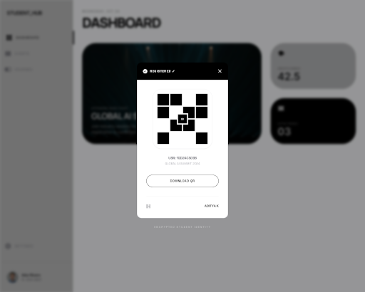
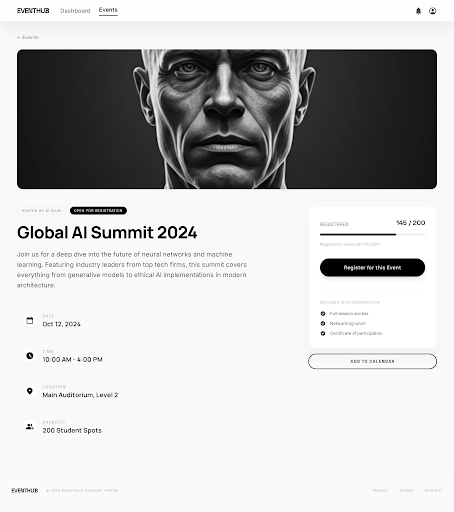
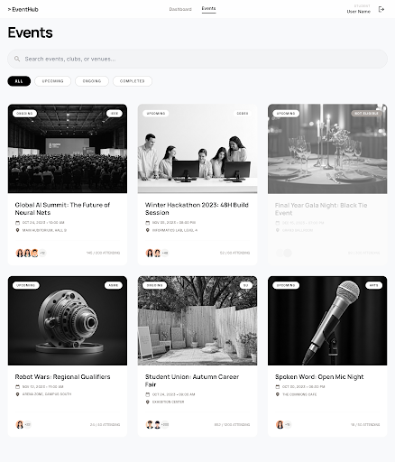
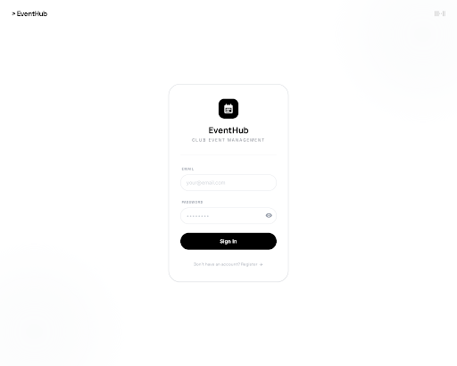
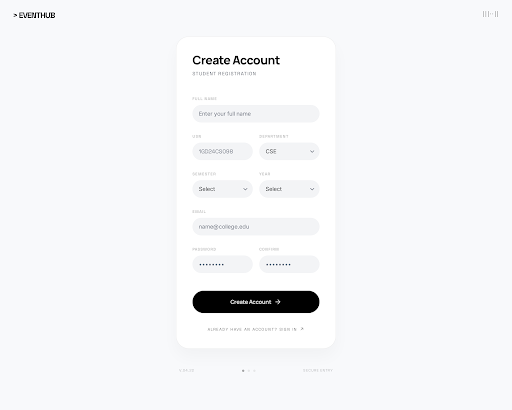
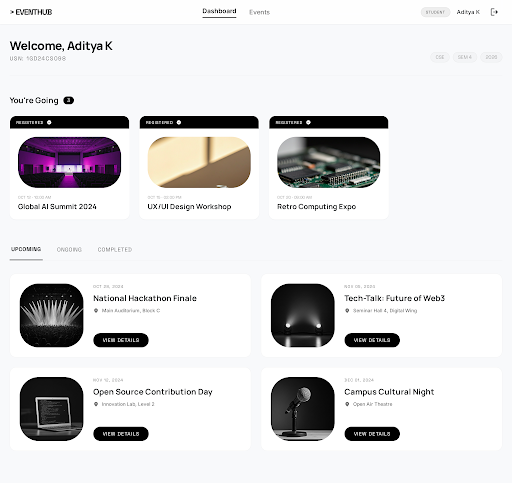

# EventHub UI Build Tasks - 2026-03-21

- [x] Create EventHub Project in Stitch
- [x] Build Auth Pages (/login, /register)
- [x] Build Student Flow (/student/dashboard, events view, detail, QR)
- [x] Build Manager Flow (/manager/dashboard, events, create/edit, attendance, scanner)
- [ ] Build Admin Flow
  - [x] User Management (Promote, Demote, Suspend)
  - [x] Event Oversight (View all events)
  - [x] QR Scanner for checking attendees
  - [x] System Backup Centre (ZIP Generation)
  - [x] On-demand User Creation & Multi-Format List Export functionality
  - [x] Build complete comprehensive Event Modifying/Editing flows with Poster handling and precise Constraint Management.
- [x] Export designs/screenshots to assets folder
- [x] Build Application Code (Next.js backend and frontend)

## Discovered During Work
- [x] Fix Next.js `Module not found` error caused by `@/*` path mapping in `tsconfig.json` pointing to the deleted `src/` directory. (See `ERROR/ERROR_1_20260321_222343/summary.md`)
- [x] Fix missing Tailwind CSS styling caused by `content` paths in `tailwind.config.ts` pointing to the deleted `src/` directory. (See `ERROR/ERROR_2_20260321_222655/summary.md`)
- [x] Fix `TypeError` crash in `/register` Server Action caused by using incorrect Zod error property mapping. (See `ERROR/ERROR_3_20260321_230228/summary.md`)
- [x] Fix Supabase `new row violates row-level security policy` by defining the missing user and manager RLS permissions. (See `ERROR/ERROR_4_20260321_230433/summary.md`)
- [x] Fix Server Action unauthenticated RLS insertion failure post-signup using the Service Role admin client. (See `ERROR/ERROR_5_20260321_231218/summary.md`)
- [x] Fix 404 error on `/student/dashboard` redirect by removing the Next.js parenthesis Route Groups from folder names. (See `ERROR/ERROR_6_20260321_231651/summary.md`)
- [x] Fix `TypeError: fetch failed` 307 redirect loops caused by Next.js `.next` cache desync after renaming core route folders. (See `ERROR/ERROR_7_20260321_233701/summary.md`)
- [x] Fix 307 infinite redirect loop between middleware and layout caused by ghost auth accounts created prior to previous RLS fixes. (See `ERROR/ERROR_8_20260321_234315/summary.md`)
- [x] Fix 404 error on Admin login caused by missing `app/admin/dashboard` components by scaffolding the core Admin Layout and Dashboard. (See `ERROR/ERROR_9_20260321_235005/summary.md`)
- [x] Fix `TypeError: registerForEvent is not a function` crash on Student Registration button. (See `ERROR/ERROR_10_20260322_002234/summary.md`)
- [x] Fix Admin Suspend functionality failing due to Postgres ENUM strictly rejecting `'deleted'` and PostgREST schema cache desync. (See `ERROR/ERROR_11_20260322_002234/summary.md`)
- [x] Enhance Student Registration UX by replacing raw form submission with an interactive Client Component featuring micro-animations and native Toast notifications. (See `ERROR/ERROR_12_20260322_002600/summary.md`)
- [x] Fix `qr_token` not-null constraint violation failing backend registration inserts by dynamically generating Web Crypto UUIDs. (See `ERROR/ERROR_13_20260322_002700/summary.md`)
- [x] Fix `View QR Code` logic ignoring the token and defaulting to a `dashboard` route redirect by scaffolding the interactive `QRButton` Client Modal trigger. (See `ERROR/ERROR_14_20260322_002800/summary.md`)
- [x] Fix Registration UI incorrectly throwing `isRegistered = false` on page-load because Supabase PostgREST silently failed the nested `.profiles(full_name)` join without an explicit Foreign Key reference in PostgreSQL. (See `ERROR/ERROR_15_20260322_003500/summary.md`)
- [x] Fix Admin/Manager Attendance Roster UI returning blank student names and `manualCheckIn` failing by explicitly escalating the Server Components to the Edge Service Role Key, effortlessly bypassing Postgres RLS blocks. (See `ERROR/ERROR_16_20260322_010200/summary.md`)
- [x] Fix empty table rows perpetually rendering after DB repairs due to NextJS 14 aggressively persisting stale Server Component fetch caches by surgically passing `cache: 'no-store'` into the global Supabase Edge Client. (See `ERROR/ERROR_17_20260322_010800/summary.md`)
- [x] Fix Admin Attendance page `Registered (0)` crash caused by requesting an invalid `email` column inherently missing from the PostgREST `profiles` layout payload. (See `ERROR/ERROR_18_20260322_012200/summary.md`)
- [x] Extract and refine the `ShieldLoader` into a reusable component to handle both Login and Logout flows with custom timed sequences and theme detection. (See `Updates/FEATURE_LOGOUT_LOADER_20260328_223500.md`)

## Generated Designs

