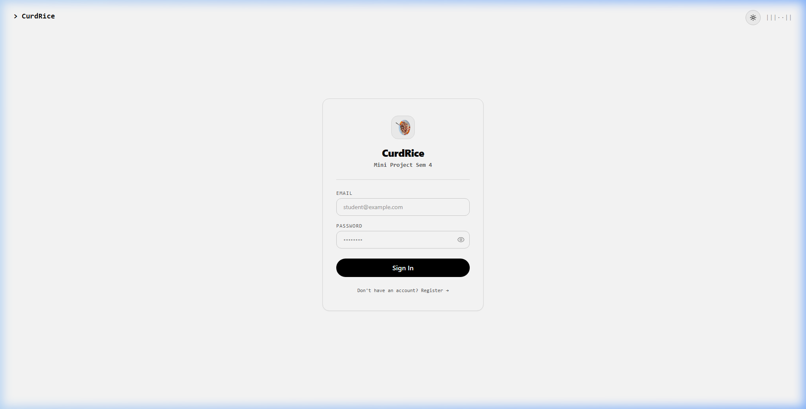
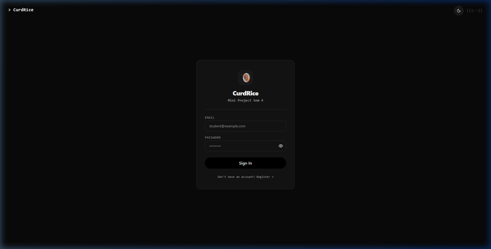
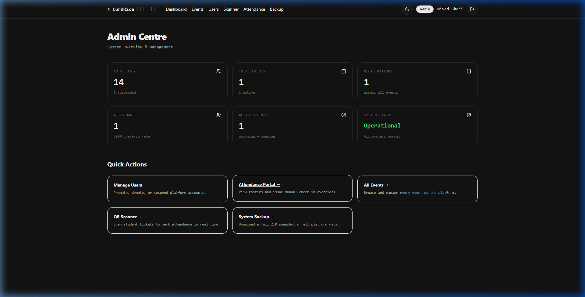
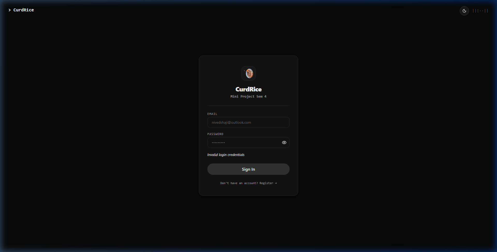
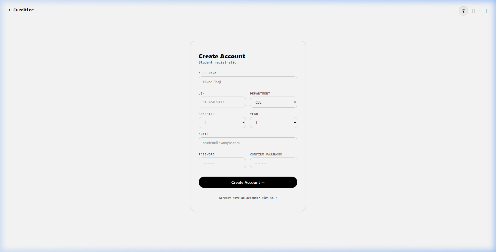
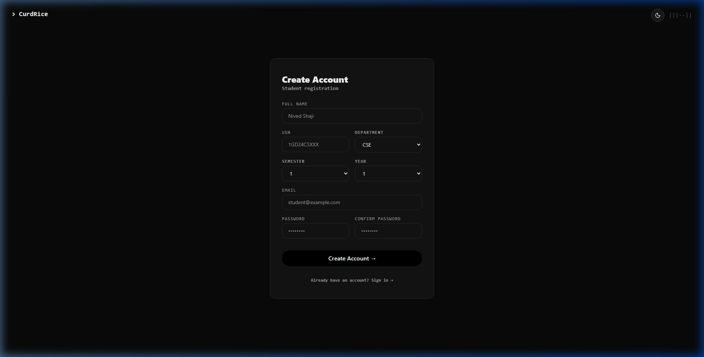
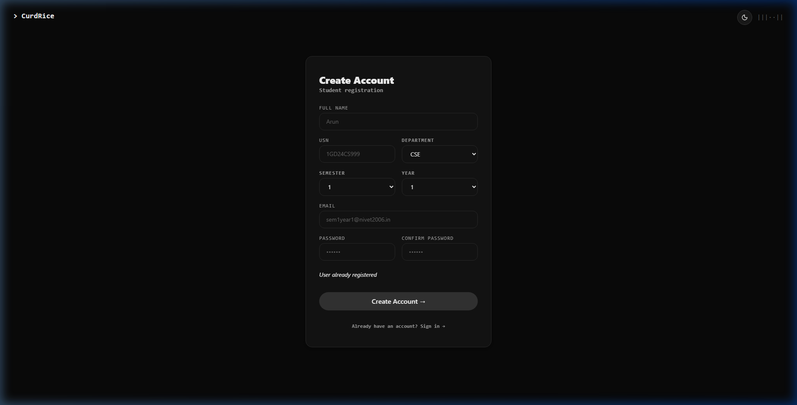
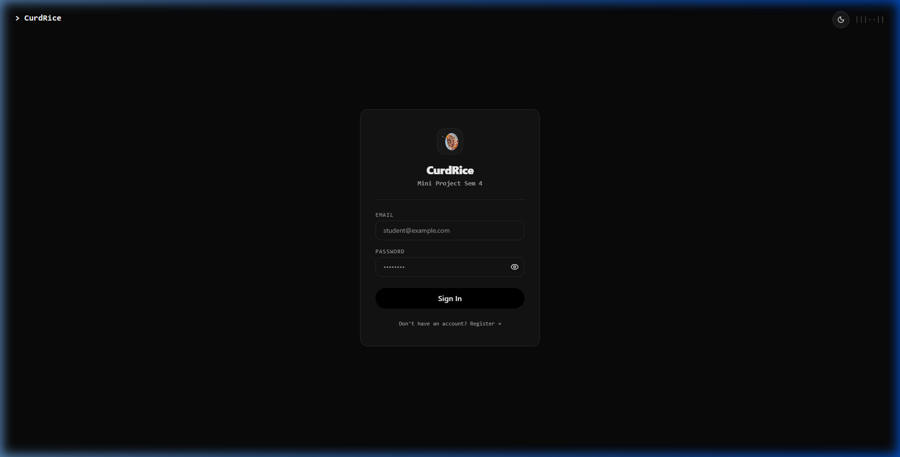
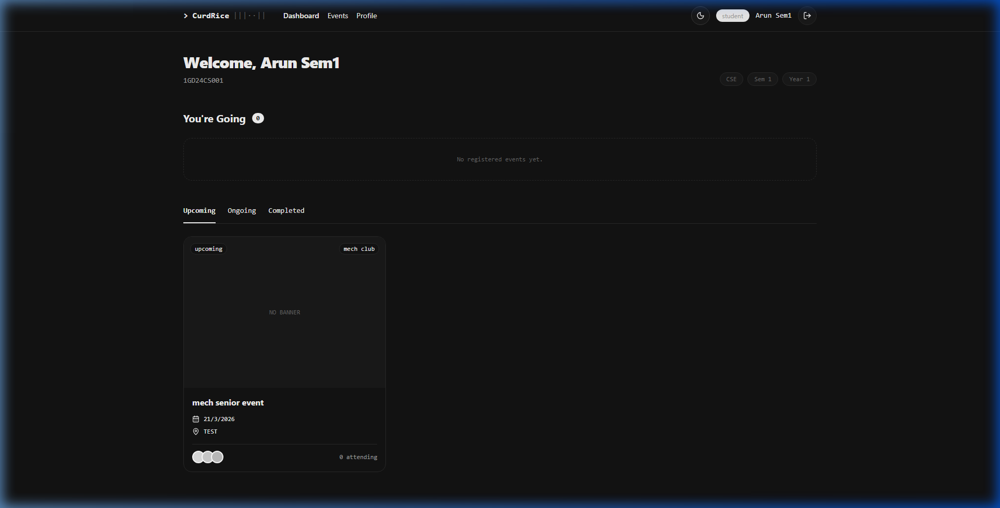

# TEST_01 — Authentication Flow

**Date**: March 23, 2026
**Tester**: Antigravity Automated Agent
**Status**: PASS

---

## Summary
The authentication flow was tested for both Login and Register pages. This included UI verification in light/dark modes, functional testing of credentials (wrong password, unregistered user), duplicate registration handling, and authentication/authorization guard enforcement. All systems performed as expected.

---

## Test Cases

### TC-01-01: Login Page UI (Light/Dark)
**Steps**:
1. Navigate to `/login` in Light mode.
2. Toggle to Dark mode.

**Expected**: UI should adapt correctly to both themes with high contrast and premium aesthetics.
**Actual**: Login page renders perfectly in both modes. Theme toggle is responsive.
**Status**: ✅ PASS
**Screenshots**: 

### TC-01-02: Shield Loader Animation
**Steps**:
1. Enter valid credentials and submit.

**Expected**: Full-screen Shield Loader overlay should appear immediately, showing animated security steps.
**Actual**: Shield Loader displays a pulsing shield and cycles through "Checking credentials", "Verifying browser integrity", etc.
**Status**: ✅ PASS
**Screenshot**: 

### TC-01-03: Login Error Handling
**Steps**:
1. Attempt login with incorrect password.
2. Attempt login with unregistered email.

**Expected**: System should show "Invalid login credentials" and dismiss the loader.
**Actual**: Error messages appear as expected. Loader dismisses immediately on failure.
**Status**: ✅ PASS
**Screenshot**: 

### TC-01-04: Register Page UI & Functionality
**Steps**:
1. Navigate to `/register`.
2. Capture Light/Dark mode.
3. Successfully register new student accounts.

**Expected**: Registration form should be usable and correctly assign students to 'student' role.
**Actual**: Form is clean, responsive, and persists data correctly to Supabase.
**Status**: ✅ PASS
**Screenshots**:

### TC-01-05: Duplicate Registration
**Steps**:
1. Attempt to register with an email already in the database.

**Expected**: System should block registration with "User already registered" message.
**Actual**: Registration is blocked and error is displayed.
**Status**: ✅ PASS
**Screenshot**: 

### TC-01-06: Auth & Role Guards
**Steps**:
1. Try accessing `/admin/dashboard` while logged out.
2. Try accessing `/admin/dashboard` while logged in as a student.

**Expected**: 
1. Redirect to `/login` if unauthorized.
2. Block or redirect if role is insufficient.
**Actual**: Logout users are sent to login. Students are kept on their own dashboard when trying to reach admin routes.
**Status**: ✅ PASS
**Screenshots**:

---

## Bugs Found
None found during this phase.

---

## Recommendations
- Consider adding "Forgot Password" flow for production readiness.
- Ensure the USN field has regex validation on the client side to match the specified college format.
