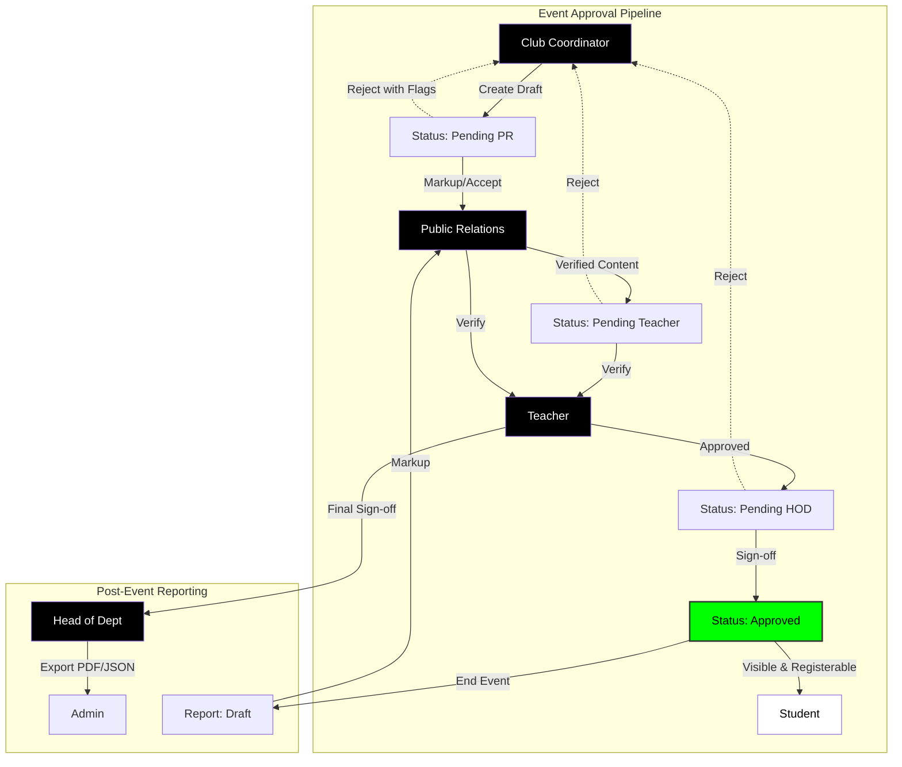

# Future Autonomous AI Pipelines (Zero-Budget, Local Processing)

Since we successfully proved that we can run Machine Learning entirely locally on your CPU for free using the `natural` JS architecture, there are incredibly sophisticated AI pipelines we can build natively into the platform without relying on OpenAI or paying for expensive API keys!

Here are highly scalable, zero-budget AI features we can orchestrate natively into Club-Eve:

### 1. 🔮 Smart "Curated for You" Matchmaking Engine
Instead of just showing random events, we can use an advanced algorithm like **TF-IDF mapping** or **K-Nearest Neighbors (KNN)** to cluster student profiles.

*   **How it works:** We read the student's department, check the history of every event they previously registered for, extract those semantic keywords, and mathematically rank upcoming events based on their individual vector scores.
*   **Result:** A hyper-personalized Netflix-style "Recommended for You" carousel on the student dashboard that adapts dynamically to their taste!

### 2. 🏷️ Automated Description Tagging for Managers
When a Club Manager creates a new event, they type out a long text description. We can use the NLP engine to instantly skim that raw text contextually.

*   **How it works:** The Bayes Classifier instantly assigns probabilistic categories based on the language used.
*   **Result:** The moment they hit "Create," the system magically auto-generates sleek tags like `#Technology`, `#Social`, or `#Workshop` attached to the Event Card without the manager ever needing to classify them manually.

### 3. 🚨 Sentiment Analysis for the Admin Inbox
If we introduce a "Contact Admin" or "Feedback" pipeline for students via the chat UI, we can pass their raw message through a mathematical Sentiment Evaluator.

*   **How it works:** It objectively assigns a value between `+1.0` (happy) and `-1.0` (frustrated) using native statistical language modeling.
*   **Result:** The Admin/Manager dashboard instantly flags violently frustrated messages (`< -0.5`) in bright red at the absolute top of their queue, accelerating emergency response times natively!

### 4. 🧠 Jaro-Winkler Typo Corrections in Eve Bot
Right now, if someone types "how cdo i cgange my uaernawe", the statistical model might get confused. We can build a parallel **String Distance Math Function** (Jaro-Winkler distance).

*   **How it works:** It measures pixel-by-pixel character drift based on standard English logic algorithms.
*   **Result:** Eve Bot instantly realizes they mistyped it and dynamically replies: *"I didn't quite catch that. Did you mean **Change my username**?"* with a clickable button for it!

### 5. 📉 Demand Forecasting & Capacity Prediction
If a club has 200 seats, they need to know if they over-marketed or under-marketed.

*   **How it works:** We write a lightweight **Linear Regression model** running inside Next.js. The model charts the registration velocity of past events (e.g., "50 sign-ups in 2 hours") to statistically predict the final turnout array of active events.
*   **Result:** Managers get an automated dashboard widget saying: *"Projections indicate you will exceed maximum capacity by 45 participants. Consider halting external registrations."*

### 6. 🛡️ Bot/Spam Activity Detection (Heuristic Validation)
If a user tries to mass-register for 40 events using automated scripts to drain QR codes.

*   **How it works:** A basic local clustering algorithm tracks requests-per-minute alongside standard user UI flow patterns.
*   **Result:** The system silently categorizes the account as an anomaly matrix and places an invisible "shadow" lock preventing successful commits without disturbing the rest of the student body.

### 7. 🤬 Toxicity & Profanity AI Chat Filter
When dealing with open chatting (DMs or Group messaging), we must ensure a safe campus environment without having admins read every single private message.

*   **How it works:** By securely injecting **TensorFlow.js's local Toxicity Model** or expanding our **Bayesian Classifiers** natively into the WebSockets architecture, the backend intercepts massive payloads in milliseconds natively. 
*   **Result:** If a student tries to send a heavily toxic, threatening, or vulgar message, the AI pipeline automatically halts the `INSERT` command, aggressively blocking the message from rendering, and throws an automated dynamic popup warning: *"Your message violates Community Conduct Rules."* If they trigger it 3 times, it instantly shadow-bans their chat privileges gracefully!

### 8. 📢 Global & Event-Specific Noticeboard Engine
A robust communication layer allowing Admins/Managers to rapidly post formatted structural alerts or announcements.

*   **How it works:** Utilizing the natively installed `react-markdown` and `remark-gfm` dependencies. Supports **Global Notices** for all students and **Event-Specific Notices** visible only to registered attendees of a particular event.
*   **Result:** Students receive hyper-relevant updates (venue changes, prerequisites) directly on their dashboard cards.

### 9. 💬 Autonomous Event Discussion Threads
Transform every event registration into an instant networking opportunity through automated group chat creation.

*   **How it works:** On successful registration, the system automatically joins the student to a specific `event_id` conversation thread within the messaging panel. 
*   **Result:** A "WhatsApp-style" discussion page for every event where attendees can coordinate and interact securely.

### 10. 📅 Student Personalized Calendar Hub
Moving beyond a global event list to a unified, user-specific scheduling interface.

*   **How it works:** A dedicated view for each student that visualizes their specific registration timeline, deadlines, and event hours in a high-contrast grid.
*   **Result:** Students never miss a registered event and can plan their semester visually.

### 11. 🖼️ Dynamic Event-Specific Theming
Allowing setiap event to have its own unique visual identity.

*   **How it works:** Managers can upload custom backgrounds or select theme presets for their event detail pages.
*   **Result:** A more immersive, "premium" feel where each event page looks like a dedicated landing page.

### 12. 🪪 Physical Smart-ID / Visitor Pass (Premium Addition) 📈
A long-term hardware integration to replace manual stamps or paper-based campus check-ins.

*   **How it works:** Implementation of rewritable physical ID cards with embedded QR/Barcodes. Data can be saved and rewritten locally for visitor pass functionality.
*   **Budgetary Note:** This is a high-budget physical expansion. It prevents the need for physical stamps/signatures at college events by acting as a digital identity token.

### 13. 🎓 Interactive AI Onboarding Tour
A high-converting walkthrough system for first-time authenticated users to ensure feature discoverability.

*   **How it works:** Upon the first login detect (via a `tour_completed` profile flag), Eve Bot automatically initiates a "Feature Spotlight" sequence.
*   **Result:** The UI dims, and specific components (QR Pass, Event Explorer, Messaging) are highlighted sequentially with guided tooltips narrated by Eve, ensuring every student knows exactly how to navigate the platform.

---

## ✅ Successfully Implemented
*   **🤖 Eve Bot AI Assistant**: Guide users, extract QR passes, explore unregistered events, and manage profile/usernames via natural language processing.
*   **🛠️ Bayesian NLP Engine**: Localized Machine Learning brain running for $0 cost without external API keys.
*   **🎨 Monochrome Premium UI**: Strict Black/White aesthetic with glassmorphism and advanced "beaming" animations.
*   **🎫 Interative QR Card System**: Secure, localized QR extraction and rendering within chat.


RAN PROMPT:
Read the frontend design skill first, then analyze THEexisting CurdRice codebase to understand what's already built before designing the system.  look at THE existing project structure. build a comprehensive system design document and interactive role-architecture diagram that you can use as a blueprint — covering all roles, flows, and feature additions without disturbing existing features.ONCE YOU have everything YOU need. START buildING THE comprehensive interactive system design document for the CurdRice .Here's the complete system design for your ClubEve extension. Let me walk you through the key decisions:

**What's preserved:** The existing Admin role, all student-facing event pages, existing event creation fields, the QR attendance system, and the `profiles`/`events`/`attendance` tables — just extended, never replaced.

**The 6 tabs in the diagram above cover everything:**

- **Roles & Access** — all 6 roles with their exact permission sets
- **Event Lifecycle** — the full CC → approval → student visibility flow, including the rejection-with-field-flagging mechanic
- **Report Flow** — CC drafts → PR markup → Teacher verify → HOD exports, with the re-request cycle on rejection
- **Feature Matrix** — a clean truth table of who can do what across every feature
- **DB Schema** — every new table and every column extension to existing tables, with field types
- **Impl Plan** — 8 ordered steps you can work through sequentially, each dependency-safe

**A few implementation notes for your Next.js + Supabase stack:**

The approval status gate for students is just a one-line addition to your existing events query: `WHERE approval_status = 'approved'`. The feedback form builder in Section C can be a local React state array of question objects `{id, type, label, options, required}` serialized to `jsonb` on save — same pattern as Google Forms. The report markup system works best as a `section` string key (e.g. `"summary"`, `"photos"`) mapped to inline comment threads, kept in `report_markups`.

Want me to start building any specific piece — the CC event creation form extension, the approval workflow, the feedback form builder, or the PR dashboard?


----
Listed directory Curdrice
Ran command: `ls -R . | grep -i skill`
Viewed future.md:1-115
Listed directory app
Listed directory lib
Viewed types.ts:1-113
Listed directory supabase
Listed directory migrations
Viewed 0000_initial_schema.sql:1-73

  

Viewed middleware.ts:1-125
Listed directory manager
Listed directory events
Viewed page.tsx:1-242

I've analyzed the existing CurdRice codebase, focusing on the Next.js/Supabase architecture and the current event/registration systems. Based on your requirements for the **Club-Eve Extension**, I have designed a blueprint that introduces the 4 new administrative roles and the automated approval/reporting pipelines.

I have created a comprehensive **Interactive System Design Document** below, which serves as our implementation blueprint.

### 🏗️ Club-Eve System Design Blueprint

This architecture maintains backward compatibility with the existing `profiles`, `events`, and `attendance` tables while extending them with state-machine-driven logic.

````carousel

<!-- slide -->
| Feature | CC | PR | Teacher | HOD | Admin | Student |
| :--- | :---: | :---: | :---: | :---: | :---: | :---: |
| **Create Events** | ✅ | - | - | - | ✅ | - |
| **Edit Metadata** | ✅ | ✅ | - | - | ✅ | - |
| **Banner Markup** | - | ✅ | - | - | - | - |
| **Final Approval**| - | - | ✅ | ✅ | ✅ | - |
| **QR Attend** | ✅ | - | - | - | ✅ | ✅ |
| **Feedback Config**| ✅ | - | - | - | - | - |
| **Report Export** | - | - | - | ✅ | ✅ | - |

**Key Metric**: No modification to existing student pages is required beyond adding the `approval_status = 'approved'` filter.
<!-- slide -->
### 🗄️ Database Schema Updates

**1. `profiles.role` Extension**
- New Enum Values: `cc`, `pr`, `teacher`, `hod`

**2. `events` Table Extensions**
- `approval_status`: `draft` | `pending_pr` | `pending_teacher` | `pending_hod` | `approved` | `rejected`
- `rejection_data`: `jsonb` - Stores `{field: string, reason: string}[]`
- `feedback_config`: `jsonb` - Stores `{id, type, label, required}[]`
- `department_id`: Link to specific department (HOD scoping).

**3. `reports` Table (New)**
- `id`, `event_id`, `content`: `jsonb` (Summary, Photos, Outcomes)
- `markup_count`: `int`
- `status`: `draft` | `pending_teacher` | `completed`

**4. `report_markups` Table (New)**
- `id`, `report_id`, `author_id`, `section_key`, `comment`, `resolved_at`
````

### 🚀 Implementation Roadmap

1.  **Phase 1: Database & Types**: Update the `user_role` and `event_status` enums in Supabase. Add the new columns to `events` and create `reports`/`report_markups`.
2.  **Phase 2: Middleware & Routing**: Expand `middleware.ts` to handle the new RBAC (Role-Based Access Control) paths for `/cc`, `/pr`, `/teacher`, and `/hod`.
3.  **Phase 3: Event Draft Lifecycle**: Modify the existing event creation form to default to `pending_pr` rather than `upcoming`. Implement the "Rejection Flagging" UI for PR/Teachers.
4.  **Phase 4: Approval Dashboards**: Build lightweight, high-contrast dashboards for PR, Teacher, and HOD to see their pending queue.
5.  **Phase 5: Feedback Builder**: Implement the serialized `jsonb` form builder for CCs.
6.  **Phase 6: Reporting Pipeline**: Create the post-event report drafting interface.
7.  **Phase 7: Markup System**: Build the inline comment system for PR/Teacher report review.
8.  **Phase 8: Export Engine**: Add CSV/JSON export functionality for HODs and Admins.

### Next Step
Which component should we begin building first?
*   **A**: The **CC Event Creation Extension** (staged approval flow).
*   **B**: The **PR/Teacher/HOD Dashboards** (queue-based approval UI).
*   **C**: The **Internal Feedback Form Builder** (JSONB serialization).
*   **D**: The **Database Migration Script** (setting up the new roles and columns).

I recommend starting with **D** to establish the foundation. Shall I proceed?


PARALLAX CREATE PARALLAX MOTIONA